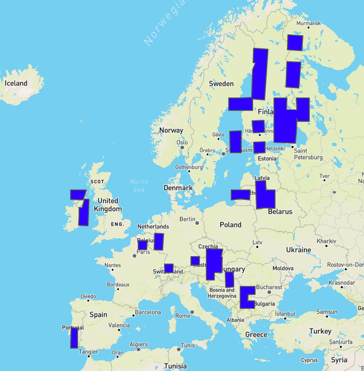

# VisEx-RS

This application was created during the Database Project Course at TU Berlin in 2020 by Leonhard Rose, Trang Nguyen and Alina Ustymenko.
It consists of an application that can be used to explore Data from the [Big-EarthNet Dataset](http://bigearth.net/), and SQL that can be used to generate a more consistent, grid-like structured dataset that represents the original data in a form that is more useful for visual exploration.

## About BigEarthNet
BigEarth Net is a data set, that provides a large amount of satellite data from the [Copernicus Data Hub](https://www.copernicus.eu/en) (a project of the EU and ESA), split up into small tiles, that are tagged with metadata
containing information about the type of terrain in the tile. These tags can be grouped together two times,
so a tile that is tagged with "Sea and Ocean" will be considered for queries asking for "Sea and Ocean", "Marine waters" (which also includes "Coastal Lagoons" and "Estuaries") and "Water bodies" (which contains all... water bodies).

These areas are covered by the data set:

## Visual Exploration
This application allows to gain insights from visual Exploration by providing three different graphs for user specified queries:

Visualizing simple queries against the underlying dataset, where all tiles are shown that match the filter shown here

Generating Chloropleth Maps for Tags based on the generated data for the geohash-based grid (Algorithm explained below)

Selecting an area in the chloropleth map will generate a line graph for the developement over time of the area covered by this tag

## Generating more Consistent Data
For retrieving information about the actual terrain or the development of the terrain over time, looking at the raw data is not that useful, because neither the areas captured by the satellite have the same size and position, nor
do the tiles, in which the satellite images are subdivided. Furthermore, the satellite never captures one complete area, but rather only a part of it each time, so there is also an partial dataset at each point of time.
The algorithm provided here, transforms this data set, into a data set, where for each point of time, there is complete information about a whole area available. 
For this, Missing Data is filled up using a simple Last Observation Carried Forward Imputation. After that, for each [GeoHash](https://en.wikipedia.org/wiki/Geohash) of a specified length, that intersects with an area we have data for, 
it is calculated how much of it is covered by specific tags, based on either an original, or imputated data point.

These data points can also be easily aggregated to larger areas, since you'd just have to sum up the values of the entries for all geohashes starting with the same sequence.
This is also the data that is beeing displayed in the aggregated tab.

The algorithm is realized in PostgresSQL (with the PostGIS Extension), without the use of a procedural programming language like PL/pgSQL. This speeds up operations considerably, but on a modestly equipped server (we used a 4 core, 12GB Ram server), it still takes multiple days and the queries should be split up into different areas, since RAM and Storage Space might run out due to the large temporary tables being generated.

## Live Online Demo
W.I.P.
