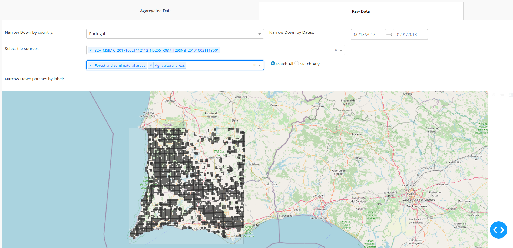
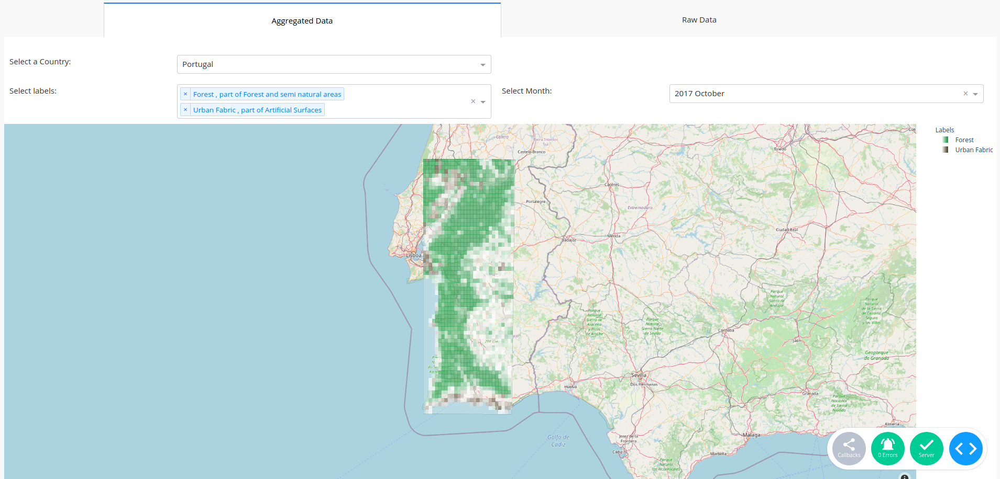
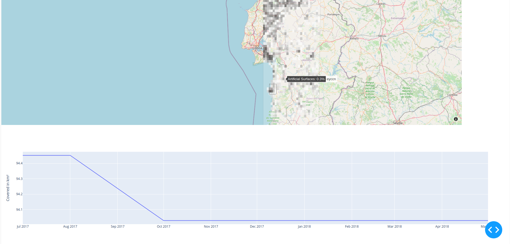

# VisEx-RS

This application was created during the Database Project Course at TU Berlin in 2020 by Leonhard Rose, Trang Nguyen and Alina Ustymenko.
It consists of an application that can be used to explore Data from the [Big-EarthNet Dataset](http://bigearth.net/), and SQL that can be used to generate a more consistent, grid-like structured dataset that represents the original data in a form that is more useful for visual exploration.

## Gallery

Visualizing simple queries against the underlying dataset

Generating Chloropleth Maps for Tags based on the generated data for the geohash-based grid

Selecting an area in the chloropleth map will generate a line graph for the developement over time of the area covered by this tag

